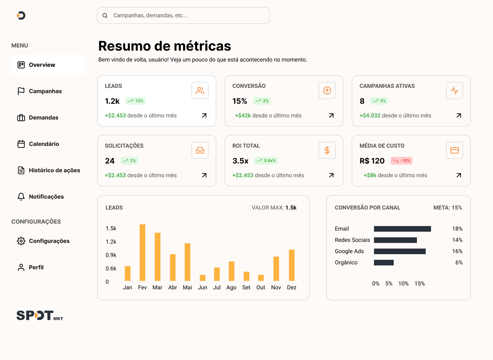

# 📊 Spot MKT - Frontend Test

## **Link para visualização do site**  
[spot-mkt-test](https://spot-mkt-test.netlify.app/)

## **Descrição do Projeto**  
Aplicativo de demonstração para uma plataforma de gestão de marketing, desenvolvido como parte de um teste técnico.

**Funcionalidades**:  
- **Tela de Login**: Autenticação simulada (sem backend real).  
- **Dashboard**: Página inicial com cards de métricas (leads, conversão, campanhas) e gráficos ilustrativos.  

**Telas de referência criadas no figma**:
- Login:

- Dasboard:


## **🛠 Tecnologias Utilizadas**  
- **Frontend**:  
  - React.js (TypeScript)  
  - TailwindCSS (para estilização)  
  - Motion (para animações)

- **Ferramentas**:  
  - Vite (para build)  
  - ESLint + Prettier (padronização de código)  
  - Husky (linting dos commits)

## **🚀 Como Rodar o Projeto**  

### **Pré-requisitos**  
- Node.js (v18+)  
- npm ou yarn  

### **Passos**  
1. **Clone o repositório**:  
   ```bash  
   git clone https://github.com/BPernes/spot-mkt-test.git
   cd spot-mkt-test
   ```  

2. **Instale as dependências**:  
   ```bash  
   npm install  
   # ou  
   yarn install  
   ```  

3. **Inicie o servidor de desenvolvimento**:  
   ```bash  
   npm run dev  
   # ou  
   yarn dev  
   ```  

4. **Acesse no navegador**:  
   ```  
   http://localhost:3000
   ```  

## **📌 Notas Adicionais**  
- **Dados fictícios**: As métricas e gráficos usam dados mockados(sem integração com APIs reais).  
- **Gráficos não interativos**: Os Gráficos são apenas demonstrativos e responsivos.
- **Objetivo do teste**: Demonstrar habilidades em UI, componentização e organização de código.  

## **😰Dificuldades**
- Layout do dashboard não ficou completamente responsivo em mobile
- Gastei mais tempo que o esperado montando o protótipo no figma o que resultou em um atraso no desenvolvimento

*Desenvolvido por Bernardo Pernes* 😊  
